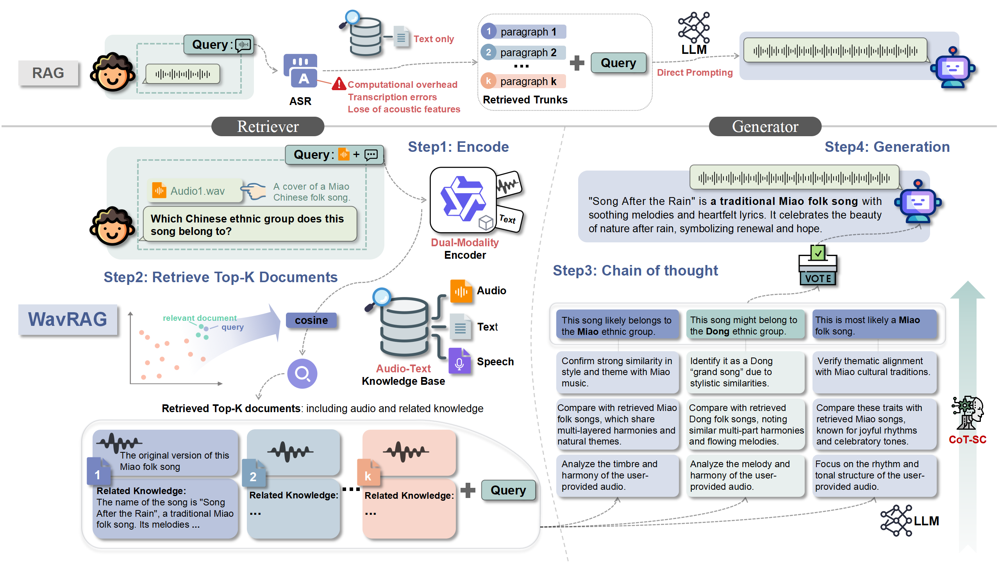
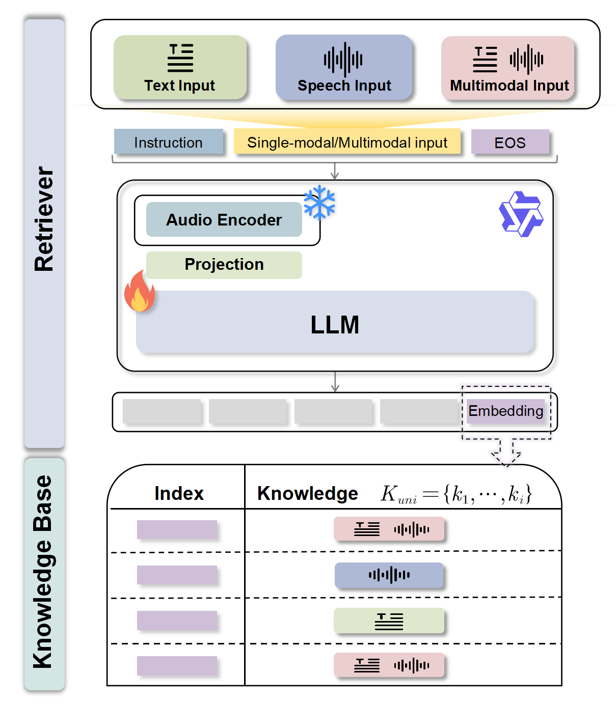

# WavRAG: Audio-Integrated Retrieval Augmented Generation for Spoken Dialogue Models

📄 arXiv 2025 · 📅 2025-02 · ✍️ Yifu Chen, Shengpeng Ji, Haoxiao Wang, et al. · 🏛️ Zhejiang University · [arXiv](https://arxiv.org/abs/2502.14727)

## TL;DR

WavRAG 是首个端到端音频原生 RAG 框架，核心组件 WavRetriever 基于 Qwen2-Audio 通过对比学习构建统一的音频-文本嵌入空间，直接处理原始音频进行检索，绕过 ASR 转录瓶颈。在多个检索场景下达到与 ASR+文本检索相当的性能，同时实现 **5.5x–14.4x 的速度提升**，并通过 Chain-of-Thought 推理和 Self-Consistency 机制显著提升生成质量。

---

## 1. 核心创新点（Innovation）

- **端到端音频 RAG 框架**：首次提出绕过 ASR、直接在原始音频上进行嵌入和检索的 RAG 系统，消除了 ASR 转录误差传播和延迟瓶颈
- **WavRetriever 多模态检索器**：基于 Qwen2-Audio 构建，通过 [[对比学习]]（InfoNCE Loss）将语音、音乐、环境音等多种音频模态与文本映射到统一嵌入空间
- **混合知识库**：支持音频+文本混合文档的统一表示与检索，覆盖 Speech-to-Text、Text-to-Speech、Speech-to-Speech、Audio+Text 四种检索场景
- **CoT + Self-Consistency 生成策略**：零样本 Chain-of-Thought 推理结合 Universal Self-Consistency 投票机制，提升生成准确性

---

## 2. 模型设计（Model Architecture）

### 2.1 整体架构

WavRAG 框架分为**检索阶段**和**生成阶段**两个核心环节。与传统 ASR-text RAG 流水线（先 ASR 转录再文本检索）不同，WavRAG 直接在音频信号上进行编码和检索：

1. **双模态编码**（Dual-modality Encoder）：WavRetriever 对查询和知识库文档进行统一编码
2. **Top-K 文档检索**：基于余弦相似度检索最相关的 K 个文档
3. **Chain-of-Thought 推理**：对检索到的文档进行推理式知识提取
4. **LLM 响应生成**：基于提取的知识生成最终回答

> **Figure 2**：WavRAG 框架对比图。上方为传统 ASR-text RAG 流水线（需要先进行语音识别再文本检索），下方为 WavRAG 的四步流程（直接音频编码→检索→CoT 推理→生成），省去了 ASR 环节。

### 2.2 关键模块

#### WavRetriever — 多模态检索器

WavRetriever 基于 **Qwen2-Audio** 多模态大语言模型构建：

- **音频编码器**：冻结 Qwen2-Audio 的预训练音频编码器参数，保留其强大的音频理解能力
- **投影层 + LLM 骨干**：微调投影层和 LLM 骨干网络，学习统一的嵌入空间
- **输入处理**：查询与任务指令拼接，附加 EOS token，取最后一层隐状态作为嵌入向量
- **LoRA 微调**：rank=8, alpha=32, dropout=0.05，高效参数微调

> **Figure 3**：WavRetriever 架构。展示了输入处理（音频/文本/混合）、LLM 编码和知识库结构。查询经过指令模板包装后送入模型，输出嵌入与知识库文档嵌入计算相似度。

#### Chain-of-Thought + Self-Consistency 生成模块

- **Zero-Shot CoT**：使用"Let's think step-by-step"提示词引导模型生成中间推理步骤，无需任务特定训练样本
- **Universal Self-Consistency (USC)**：采样多条推理路径，由 LLM 选择最一致的答案（而非简单多数投票），提升最终回答的鲁棒性

### 2.3 技术细节

**检索分布计算**：

$$p(d|q_i) = \frac{\exp(\text{sim}(R_\phi(q_i), R_\phi(d)))}{\sum_{d_i \in \mathcal{D}} \exp(\text{sim}(R_\phi(q_i), R_\phi(d_i)))}$$

其中 $R_\phi$ 为检索器编码函数，$\text{sim}(\cdot, \cdot)$ 为余弦相似度。

**InfoNCE 对比损失**：

$$Z = \sum_{i=0}^{t} \exp\left(\frac{\text{sim}(r_q, r_{k,i})}{\tau}\right)$$

$$\mathcal{L} = -\left[\frac{\text{sim}(r_q, r_k^+)}{\tau} - \log Z\right]$$

其中 $r_q$ 为查询嵌入，$r_k^+$ 为正样本嵌入，$\tau$ 为温度参数。通过最大化正样本对相似度、最小化批内负样本相似度来优化嵌入空间。

**CoT 推理公式**：

$$C_{\text{answer}} = G_{\text{reasoning}}(q_{\text{uni}}, P_{\text{prompt}} + P', \mathcal{K}_k)$$

其中 $P'$ 为 CoT 提示，$\mathcal{K}_k$ 为检索到的 Top-K 文档。

**与 ASR-text RAG 的核心优势**：
- **消除误差传播**：ASR 转录错误（WER 可达 20%–45%）会直接影响下游检索质量，WavRAG 完全绕过该环节
- **大幅降低延迟**：省去 ASR 推理时间，在各场景下实现 5.5x–14.4x 加速
- **保留非语义音频信息**：传统 ASR 丢失音乐、环境音等非语言信息，WavRAG 的统一嵌入空间可同时表示语音、音乐和环境音

**数据增强**：训练时对音频数据依次施加回声模拟（100–500 ms 延迟，0–0.2 缩放）、MUSAN 噪声叠加和随机增益调整，提升模型鲁棒性。

---

## 3. 训练细节（Training Details）

### 3.1 数据集

- **训练规模**：约 150 万样本，覆盖五类检索场景
- **Speech-to-Text**：基于 HotpotQA、Quora 等使用 CosyVoice2 TTS 合成语音查询（约 14.5 万样本）
- **Text-to-Text**：ELI5、TriviaQA、SQuAD、MS MARCO 等纯文本检索对（约 96 万样本）
- **Speech-to-Speech**：SLUE-SQA-5、Spoken-SQuAD（约 8.3 万样本）
- **Audio+Text**：AudioCaps、MusicCaps、Clotho、VoxCeleb、Xeno-canto 等，使用 Gemini 1.5 Pro 生成扩展知识和问答对（约 13 万样本）

| 任务 | 数据集 | 训练对数 | 检索测试 | 生成测试 |
|------|--------|---------|---------|---------|
| Speech-to-Text | Quora, HotpotQA | 144,718 | 7,405 | 7,405 |
| Text-to-Text | ELI5, TriviaQA, SQuAD, MS MARCO | 959,212 | — | — |
| Speech-to-Speech | SLUE-SQA-5 | 46,186 | 2,382 | 2,382 |
| Text-to-Speech | Spoken-SQuAD | 37,111 | 5,351 | — |
| Audio+Text | 自建 + AudioCaps + MusicCaps 等 | 130,867 | 14,709 | 1,959 |

### 3.2 训练策略

- **骨干模型**：Qwen2-Audio，冻结音频编码器，LoRA 微调 LLM 骨干
- **训练配置**：LoRA rank=8, alpha=32, dropout=0.05, lr=1e-4, batch_size=64
- **硬件**：4× NVIDIA A800 (80GB)，bfloat16 精度，梯度检查点
- **损失函数**：InfoNCE 对比损失，利用批内负样本
- **Token 限制**：音频最大 2000 tokens，文本最大 512 tokens
- **评估指标**：Recall@K (R@1, R@5, R@10), nDCG@10, Exact Match (EM), FactScore

### 3.3 实验结果摘要

#### 检索性能（Table 1）

| 场景 | 模型 | 时间(s) | R@1 | R@10 | nDCG@10 |
|------|------|---------|-----|------|---------|
| Speech2Text | BGE+Whisper-Large | 1.92 | 0.4533 | 0.8895 | 0.5252 |
| | **WavRAG** | **0.23** | **0.4532** | **0.8898** | 0.5117 |
| Text2Speech | BGE+Whisper | — | 0.5464 | 0.8497 | 0.6947 |
| | **WavRAG** | **0.11** | **0.6844** | **0.9023** | **0.8483** |
| Speech2Speech | BGE+Whisper-Large | 4.63 | 0.3312 | 0.7196 | 0.3269 |
| | **WavRAG** | **0.22** | **0.3392** | **0.7221** | **0.3623** |
| Audio+Text | CLAP (AT) | 0.05 | 0.1260 | 0.3989 | 0.2474 |
| | **WavRAG** | 0.19 | **0.2728** | **0.6313** | **0.4381** |

> **Table 1**：核心检索结果。WavRAG 在 Speech2Text 场景与最强 BGE+Whisper-Large 基线性能相当，但速度提升 **8.3x**；在 Text2Speech 和 Audio+Text 场景大幅超越所有基线。

#### 生成性能（Table 2）

| 方法 | LLM | HotpotQA top-1 EM | SLUE-SQA-5 top-1 EM | Custom FactScore |
|------|-----|-------------------|---------------------|-----------------|
| TextRAG | GPT-4o | 0.3124 | 0.3237 | — |
| WavRAG | GPT-4o | 0.4019 | 0.3904 | 0.5732 |
| **WavRAG-CoT** | **GPT-4o** | **0.4261** | **0.4520** | **0.6412** |
| TextRAG | QwenAudio | 0.1783 | 0.2439 | — |
| WavRAG-CoT | QwenAudio | 0.2688 | 0.3132 | 0.6386 |

> **Table 2**：生成性能。WavRAG-CoT + GPT-4o 在所有指标上均显著超越 TextRAG 基线，HotpotQA EM 提升 36.4%，SLUE-SQA-5 EM 提升 39.6%。

#### 消融实验（Table 3）— 对比学习的效果

| 数据集 | 指标 | Qwen2Audio 原始 | WavRAG | 提升 |
|--------|------|----------------|--------|------|
| Custom | R@1 | 0.0675 | 0.2728 | +0.2053 |
| | nDCG@10 | 0.1212 | 0.5381 | +0.4169 |
| Spoken-SQuAD | R@1 | 0.3407 | 0.6844 | +0.3437 |
| | nDCG@10 | 0.3554 | 0.8483 | **+0.4929** |
| HotpotQA | R@1 | 0.1457 | 0.4532 | +0.3075 |
| | nDCG@10 | 0.2868 | 0.5117 | +0.2249 |

> **Table 3**：消融实验证明对比学习训练带来巨大提升，R@1 提升 0.20–0.34，nDCG@10 提升 0.22–0.49。

---

## 4. 相关工作

### BGE + Whisper-Large：级联式 ASR-Text 检索基线

WavRAG 论文中最重要的 baseline 是 **BGE + Whisper-Large** 级联方案，代表了传统 ASR-text RAG 的最强链路：

**流程**：Audio → Whisper-Large ASR 转录 → BGE 文本嵌入 → 余弦相似度检索

- **Whisper-Large**（OpenAI, 2022）：1.55B 参数的多语言 ASR 模型，基于 68 万小时多语言标注数据训练，采用 encoder-decoder Transformer 架构。在多数语言上达到接近人类的转录精度，是目前开源 ASR 的事实标准
- **BGE**（BAAI, Xiao et al., 2024）：BAAI 通用嵌入模型系列，通过 RetroMAE 预训练 + 对比学习微调的两阶段训练，在 MTEB 榜单上表现优异。支持 instruction-based embedding，可根据任务指令调整嵌入语义

**优势**：
- 文本检索质量极高，BGE 在纯文本检索任务上是 SOTA 级别
- Whisper-Large 转录精度高，在干净语音场景下 WER 可低于 5%
- 组件成熟、易于部署，工程链路清晰

**劣势（WavRAG 论文论证的核心对比点）**：
- **延迟瓶颈**：ASR 推理占据绝大部分延迟。Speech2Text 场景 1.92s vs WavRAG 0.23s（8.3x 差距），Speech2Speech 场景 4.63s vs 0.22s（21x 差距）
- **ASR 误差传播**：Whisper 在噪声、口音、专有名词上的 WER 可达 20%–45%，转录错误直接传导至检索质量下降
- **非语言信息丢失**：ASR 仅输出文字，完全丢弃音乐、环境音、情感韵律等信息，导致在 Audio+Text 混合检索场景下无法工作

**与 WavRAG 的关键对比**：

| 维度 | BGE + Whisper-Large | WavRAG |
|------|-------------------|--------|
| 架构 | 级联（ASR → 文本嵌入） | 端到端（音频 → 统一嵌入） |
| Speech2Text R@1 | 0.4533 | 0.4532（持平） |
| Speech2Text 延迟 | 1.92s | 0.23s（8.3x↓） |
| Speech2Speech R@1 | 0.3312 | 0.3392（略优） |
| Audio+Text 支持 | ❌ 不支持 | ✅ R@1=0.2728 |
| 误差来源 | ASR WER + 嵌入误差 | 仅嵌入误差 |

> **核心结论**：在纯语音-文本检索场景，BGE+Whisper-Large 的检索质量与 WavRAG 几乎持平，级联方案在质量上并未被超越。WavRAG 的核心价值在于：(1) 大幅降低延迟；(2) 泛化到非语言音频检索；(3) 消除 ASR 误差传播风险。

---

## 5. 挑战与展望

- **情感与韵律建模**：当前 RAG 主要关注语义内容，语音中的情感色彩、语调韵律等 [[副语言学]]（Paralinguistics）信息在生成响应中的作用尚未充分探索
- **音频理解的深度**：尽管绕过了 ASR，但音频嵌入对复杂语义理解（如隐喻、反讽）的捕获能力仍有提升空间
- **知识库规模扩展**：论文实验中知识库规模相对有限，大规模音频知识库（百万级文档）下的检索效率和质量有待验证
- **多轮对话支持**：当前框架聚焦单轮问答，多轮对话上下文的持续检索和更新是重要方向

---

## 6. 与我的关联

- **ASR 热词检索的替代思路**：WavRAG 证明了直接音频嵌入检索的可行性，对现有 CLAP-based 热词检索方案提供了一种端到端的替代思路，尤其在低延迟场景下优势明显
- **WavRetriever 的对比学习方案**：InfoNCE + 批内负样本的训练策略与现有 CLAP 检索工作一脉相承，可借鉴其数据增强策略（回声模拟、MUSAN 噪声）提升检索鲁棒性
- **多模态知识库构建**：使用 Gemini 1.5 Pro 对音频-文本对进行知识扩展的思路，可用于丰富热词知识库的上下文信息

---

## 7. 思考

**1. 音频原生检索 vs ASR 前置检索的权衡**

WavRAG 的核心论点是"绕过 ASR"，但实验数据揭示了一个微妙的平衡：在 Speech-to-Text 场景下，WavRAG 与 BGE+Whisper-Large 的检索性能几乎持平（R@10: 0.8898 vs 0.8895），真正的优势在于延迟（0.23s vs 1.92s）。这说明对于纯语音-文本检索，ASR 管线在质量上并未被超越，WavRAG 的核心价值在于速度和对非语言音频的泛化能力。

**2. 统一嵌入空间的意义**

从 PCA 可视化（Figure 6）来看，WavRAG 相比 CLAP 和原始 Qwen2-Audio 构建了更好分离的嵌入空间。这一点对多模态检索至关重要——CLAP 在 Audio+Text 混合检索场景下几乎完全失效（R@1 接近 0），而 WavRAG 达到了 R@1=0.2728。这暗示基于大语言模型的多模态编码器在构建统一嵌入空间方面具有本质优势。

**3. 对比学习的关键作用**

消融实验显示，仅使用 Qwen2-Audio 原始嵌入的检索性能极差（HotpotQA R@1 仅 0.1457），对比学习训练后提升至 0.4532。这证实了：预训练多模态模型的通用表示并不直接适用于检索任务，必须通过任务特定的对比学习进行嵌入空间优化。这一结论同样适用于其他基于 MLLM 的检索系统设计。

**4. CoT 和 Self-Consistency 的叠加收益**

WavRAG → WavRAG-CoT 的提升（HotpotQA EM: 0.4019 → 0.4261）表明 CoT 推理在 RAG 生成阶段仍有显著价值。Self-Consistency 通过采样多条推理路径并选择最一致答案，有效缓解了单次推理的不稳定性。这种"检索+推理+一致性验证"的三层架构值得在其他 RAG 系统中借鉴。

---

## 参考文献

- **Qwen2-Audio** (Chu et al., 2024) — WavRetriever 的骨干模型，强大的音频理解 MLLM
- **CLAP** (Laion-AI, 2023) — 对比语言-音频预训练，Audio+Text 检索基线
- **BGE** (Xiao et al., 2024) — 文本嵌入模型，ASR-text RAG 的检索基线
- **CosyVoice2** — 用于合成训练数据中语音查询的 TTS 系统
- **Universal Self-Consistency** (Chen et al., 2023) — LLM 推理一致性选择方法
- **SLUE-SQA-5** — 口语问答基准测试集
- **Spoken-SQuAD** — 语音版 SQuAD 阅读理解数据集
